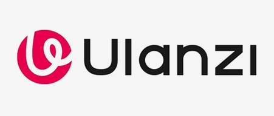

# Elgato Wave Link Control — plugin Ulanzi D200X

Drives the audio channels and mixes of **Elgato Wave Link** from an **Ulanzi D200X**.
Each key is bound to a channel, or to a channel within a mix, chosen in its
property inspector.

Tested on Wave Link **3.3.0 (build 4529)** and Ulanzi Studio 3.x, on Windows.

Pilote les canaux audio et les mixes d'**Elgato Wave Link** depuis un **Ulanzi D200X**.
Chaque touche est liée à un canal, ou à un canal dans un mix, choisi dans son
inspecteur de propriétés.

Testé sur Wave Link **3.3.0 (build 4529)** et Ulanzi Studio 3.x, sous Windows.

---

<br>
<table>
  <tr>
    <td align="center"></td>
    <td align="center"><a href="https://ko-fi.com/razganariel"></a></td>
  </tr>
</table>
<br>

---

## 1. Actions

**English**

| Action | Control | Rotation | Press |
|---|---|---|---|
| **Channel Mute** | Key | — | Toggles mute on the channel, or on the channel **within** the selected mix |
| **Channel Volume** | Encoder | Channel level, or the channel's level within the selected mix | Toggles the same mute |
| **Channel Volume Up** | Key | — | +1 step |
| **Channel Volume Down** | Key | — | −1 step |
| **Mix Volume** | Encoder | Mix master fader | Toggles the mix mute |
| **Mix Mute** | Key | — | Toggles the mix mute |
| **Connect** | Key | — | (Re)connects and refreshes the list |

Each action is bound to **one single** channel or mix at a time
(`SupportedInMultiActions: false`).

The four *mute* actions — the two keys and the two encoders, since pressing an
encoder is one of them — offer `toggle` on a dedicated key. The two `Channel Mute`
and `Mix Mute` keys additionally offer a forced `mute` and a forced `unmute`.

The four volume actions offer the same three settings: **step**, **minimum** and
**maximum**. All four apply the same bounds, deliberately: otherwise a channel
capped at 80% on one key could be pushed to 100% from another.

### Scope: one channel, or one channel within a mix

A binding carries a single thing: a channel, or one of its **junctions** — the
channel as seen from within a mix. Wave Link keeps the two independent, and that is
what makes the junction useful:

```
channel alone          ->  the channel itself
channel + one mix      ->  only that channel within that mix
```

Muting the Stream Mix junction of "Discord" therefore does not mute "Discord"
everywhere. Settings are stored **per key**: the range and the step are entered on
each key, like the channel itself.

This notion is defined once, in `service/core/scope.js`
(`scopeLevel`, `scopeMuted`, `scopeEntry`). It used to be rewritten in four modules
that had drifted apart — hence an encoder displaying the channel's mute while its
press only affected the junction.

### Who writes a key's title

**The host, and nothing else.**

The plugin writes no text: no `setTitle`, no `title` field in the inspectors, and
above all no dynamic text. An encoder receives only its icon, through the
`setFeedback` layout:

```js
$UD.setFeedback(context, { icon: { value: 'images/action-channel-volume.svg' } });
```

That was a different design, and it had two flaws. The plugin composed the channel
or mix name, sent it as `title`, which **overwrote** what had been typed in Ulanzi
Studio's Title field; and since Wave Link notifies on every level change, every
encoder step repainted the key and the title jumped back.

| Item | Source |
|---|---|
| Title under the key | Ulanzi Studio's **Title** field |
| Encoder title | the same field, rendered by the host |
| Icon | the plugin: the mute/unmute state of the bound scope |
| Level | nowhere |

None of our dropdowns shows a percentage. An encoder has no need to state its
level: that is what its travel shows.

Channel and mix names only appear in the payload sent to the inspectors, where they
populate the dropdowns.

### Two volume notions not to be confused

- **Channel Volume** sets a channel's level. If a mix is selected in the inspector,
  it sets the level of **that channel within that mix** only
  (`channel.mixes[].level`), not the channel's global level.
- **Mix Volume** sets a mix's master fader. In Wave Link, that fader only appears
  once you open the mix's editing view — it is not on the main view. That is the
  expected behaviour, not a plugin defect.

**Français**

| Action | Contrôle | Rotation | Pression |
|---|---|---|---|
| **Channel Mute** | Touche | — | Bascule le mute du canal, ou du canal **dans** le mix sélectionné |
| **Channel Volume** | Encodeur | Volume du canal, ou du canal dans le mix sélectionné | Bascule le même mute |
| **Channel Volume Up** | Touche | — | +1 pas |
| **Channel Volume Down** | Touche | — | −1 pas |
| **Mix Volume** | Encodeur | Fader master du mix | Bascule le mute du mix |
| **Mix Mute** | Touche | — | Bascule le mute du mix |
| **Connect** | Touche | — | (re)connecte et rafraîchit la liste |

Chaque action est liée **à un seul** canal ou mix à la fois
(`SupportedInMultiActions: false`).

Les quatre actions *mute* — les deux touches et les deux molettes, la pression d'une
molette en étant une — proposent `toggle` sur une touche dédiée. Les deux touches
`Channel Mute` et `Mix Mute` offrent en plus `mute` forcé et `unmute` forcé.

Les quatre actions de volume proposent les mêmes trois réglages : **pas**, **minimum** et
**maximum**. Les quatre appliquent les mêmes bornes, volontairement : sinon un canal
plafonné à 80 % sur une touche pourrait être poussé à 100 % depuis une autre.

### La portée : un canal, ou un canal dans un mix

Une liaison porte une seule chose : un canal, ou l'un de ses **jonctions** — le canal au
seint d'un mix. Wave Link tient les deux indépendantes, et c'est ce qui rend la jonction
utile :

```
canal seul          ->  le canal lui-même
canal + un mix      ->  seulement ce canal dans ce mix
```

Muter la jonction Stream Mix de « Discord » ne met donc pas « Discord » en sourdine
partout. Les réglages sont stockés **par touche** : la plage et le pas se saisissent sur
chaque touche, comme le canal lui-même.

Cette notion est définie une seule fois, dans `service/core/scope.js`
(`scopeLevel`, `scopeMuted`, `scopeEntry`). Elle avait été réécrite dans quatre modules
qui avaient dérivé — d'où une molette affichant le mute du canal alors que sa pression
ne touchait que la jonction.

### Qui écrit le titre d'une touche

**L'hôte, et rien d'autre.**

Le plugin n'écrit aucun texte : pas de `setTitle`, pas de champ `title` dans les
inspecteurs, et surtout pas de texte dynamique. Un encodeur reçoit uniquement son
icône, via le layout `setFeedback` :

```js
$UD.setFeedback(context, { icon: { value: 'images/action-channel-volume.svg' } });
```

C'était une autre conception, et elle avait deux défauts. Le plugin composait le nom
du canal ou du mix, l'envoyait en `title`, ce qui **écrasait** la saisie du champ
Titre d'Ulanzi Studio ; et comme Wave Link notifie à chaque variation de niveau,
chaque cran de molette repeignait la touche et le titre ressautait.

| Élément | Source |
|---|---|
| Titre sous la touche | le champ **Titre** d'Ulanzi Studio |
| Titre de la molette | le même champ, affiché par l'hôte |
| Icône | le plugin : l'état mute/unmute de la portée liée |
| Niveau | nulle part |

Aucune de nos listes déroulantes n'affiche un pourcentage. Un encodeur n'a pas à dire
son niveau : c'est ce que montre sa course.

Les noms de canal et de mix n'apparaissent que dans le payload envoyé aux inspecteurs,
où ils servent à remplir les listes déroulantes.

### Deux notions de volume à ne pas confondre

- **Channel Volume** règle le niveau d'un canal. Si un mix est sélectionné dans
  l'inspecteur, il règle le niveau de **ce canal dans ce mix** uniquement
  (`channel.mixes[].level`), pas le niveau global du canal.
- **Mix Volume** règle le fader master d'un mix. Dans Wave Link, ce fader n'apparaît
  qu'en ouvrant l'édition du mix — il n'est pas sur la vue principale. C'est le
  comportement attendu, pas un raté du plugin.

---

## 2. Prerequisites

**English**

- Elgato Wave Link 3.x running (the plugin connects to the already-running process)
- Ulanzi Studio **3.0.11** or newer — the manifest's floor
- Ulanzi Studio **3.3.0** or newer for an **encoder's icon** to follow mute. On an
  earlier version, encoder display commands fail, are swallowed, and what is missing
  is the encoder's icon — the action itself still works, and the neighbouring key
  keeps showing its state
- Node.js 20 or newer to build the plugin

No native dependency: everything goes through Wave Link's local WebSocket.

**Français**

- Elgato Wave Link 3.x ouvert (le plugin se connecte au processus déjà lancé)
- Ulanzi Studio **3.0.11** ou plus récent — le seuil du manifeste
- Ulanzi Studio **3.3.0** ou plus récent pour que **l'icône d'une molette** suive le
  mute. Sur une version antérieure, les commandes d'affichage d'encodeur échouent, sont
  absorbées, et ce qui manque est l'icône de la molette — l'action elle-même fonctionne,
  et la touche voisine continue d'afficher son état
- Node.js 20 ou plus récent pour builder le plugin

Aucune dépendance native : tout passe par le WebSocket local de Wave Link.

---

## 3. Connection

**English**

Wave Link exposes a JSON-RPC 2.0 server on a local loopback. The port is discovered
at startup, in this order:

1. `%LOCALAPPDATA%\Packages\Elgato.WaveLink_g54w8ztgkx496\LocalState\ws-info.json`
   (Microsoft Store version)
2. `%APPDATA%\Elgato\WaveLink\ws-info.json`
3. `%LOCALAPPDATA%\Elgato\WaveLink\ws-info.json`
4. probe of ports 1884 to 1893

`ws-info.json` is re-read on every attempt: Wave Link picks a fresh port on every
startup, and reading the file only once leaves the plugin disconnected if it reads
the port of an instance that has already stopped.

Once connected, the plugin **never gives up**: the retry delay grows up to 30 s and
then stays there, indefinitely, until the host stops. A program that simply has not
started yet is not a permanent loss.

### API surface used

| Method | Use |
|---|---|
| `getChannels` / `getMixes` | discover channels and mixes |
| `setChannel` | global level, mute, and level or mute within a mix (`mixes: [{id, level}]`) |
| `setMix` | mix master fader, mix mute |
| `getInputDevices` / `getOutputDevices` | device state |
| `setSubscription` | subscribe to Focused App Changes |

Notifications consumed: `channelsChanged`, `channelChanged`, `mixesChanged`,
`mixChanged`, `inputDevicesChanged`, `outputDevicesChanged`, `focusedAppChanged`,
`levelMeterChanged`.

**Français**

Wave Link expose un serveur JSON-RPC 2.0 sur une boucle locale. Le port est découvert
au démarrage, dans cet ordre :

1. `%LOCALAPPDATA%\Packages\Elgato.WaveLink_g54w8ztgkx496\LocalState\ws-info.json`
   (version Microsoft Store)
2. `%APPDATA%\Elgato\WaveLink\ws-info.json`
3. `%LOCALAPPDATA%\Elgato\WaveLink\ws-info.json`
4. sonde des ports 1884 à 1893

`ws-info.json` est relu à chaque tentative : Wave Link choisit un port neuf à chaque
démarrage, et lire le fichier une seule fois laisse le plugin déconnecté s'il lit le
port d'une instance déjà arrêtée.

Une fois connecté, le plugin **ne renonce plus** : le délai de reprise monte jusqu'à
30 s puis s'y tient, indéfiniment, jusqu'à l'arrêt de l'hôte. Un programme simplement
pas encore lancé n'est pas une perte définitive.

### Surface API utilisée

| Méthode | Usage |
|---|---|
| `getChannels` / `getMixes` | découvrir canaux et mixes |
| `setChannel` | niveau global, mute, et niveau ou mute dans un mix (`mixes: [{id, level}]`) |
| `setMix` | fader master du mix, mute du mix |
| `getInputDevices` / `getOutputDevices` | état des périphériques |
| `setSubscription` | abonnement aux Focused App Changes |

Notifications consommées : `channelsChanged`, `channelChanged`, `mixesChanged`,
`mixChanged`, `inputDevicesChanged`, `outputDevicesChanged`, `focusedAppChanged`,
`levelMeterChanged`.

---

## 4. Build

**English**

```bash
npm install          # ws, for the tests
npm run sdk          # downloads the Ulanzi SDK (once)
npm run build        # -> release/com.ulanzi.ulanzistudio.wavelink.ulanziPlugin
npm test
```

The `release/` folder is the installable package. Copy its contents into:

```
%APPDATA%\Ulanzi\UlanziDeck\Plugins\com.ulanzi.ulanzistudio.wavelink.ulanziPlugin\
```

then restart Ulanzi Studio.

`npm run release` chains the SDK install and the build.

**Français**

```bash
npm install          # ws, pour les tests
npm run sdk          # télécharge le SDK Ulanzi (une fois)
npm run build        # -> release/com.ulanzi.ulanzistudio.wavelink.ulanziPlugin
npm test
```

Le dossier `release/` est le paquet installable. Copiez son contenu dans :

```
%APPDATA%\Ulanzi\UlanziDeck\Plugins\com.ulanzi.ulanzistudio.wavelink.ulanziPlugin\
```

puis redémarrez Ulanzi Studio.

`npm run release` enchaîne l'installation du SDK et le build.

---

## 5. Layout

**English**

```
plugin/
  manifest.json          7 actions, UUID com.ulanzi.ulanzistudio.wavelink
  package.json
  images/                12 SVGs (every action has a resting face and, if it can
                         mute, a muted face)
  property-inspector/    one folder per action + shared.js / shared.css
  service/
    app.js               entry point: host event routing
    actions/             the 7 actions, one per file
    core/
      constants.js       UUID, state indices, limits, allowed steps
      context.js         bookkeeping of action instances
      dial.js            rotation -> number of steps
      params.js          settings reading (clampFloat, dialStep, volumeBounds)
      registry.js        facade over Wave Link for the actions
      scope.js           level and mute of a scope: channel, or channel within a mix
      trace.js           raw frame trace, next to the host log
      ui.js              setStateIcon / setEncoderIcon
      wavelink.js        JSON-RPC WebSocket client
scripts/
  build.mjs              assembles the package, validates the manifest and the SDK
  install-sdk.mjs        downloads the Ulanzi SDK
  install-deps.mjs       installs ws without npm
tests/                   native node:test runner
  helpers.js             shared paths, and comment stripping
```

### One convention not to break: state 0

`STATE.UNMUTED` is **0**, `STATE.MUTED` is 1, and for the seven actions
`manifest.Icon` is the image of state 0.

The host draws state 0 for a key the plugin has not painted yet. That state must
therefore be the resting one: an unpressed key is not muted. The same rule applies
to the icon shown in the action picker — otherwise a never-painted key and the picker
would not show the same thing.

**Français**

```
plugin/
  manifest.json          7 actions, UUID com.ulanzi.ulanzistudio.wavelink
  package.json
  images/                12 SVG (chaque action a une face au repos et, si elle peut
                         muter, une face muette)
  property-inspector/    un dossier par action + shared.js / shared.css
  service/
    app.js               point d'entrée : routage des événements hôte
    actions/             les 7 actions, une par fichier
    core/
      constants.js       UUID, indices d'état, limites, pas autorisés
      context.js         bookkeeping des instances d'action
      dial.js            rotation -> nombre de pas
      params.js          lecture des réglages (clampFloat, dialStep, volumeBounds)
      registry.js        façade vers Wave Link pour les actions
      scope.js           niveau et mute d'une portée : canal, ou canal dans un mix
      trace.js           trace brute des frames, à côté du log hôte
      ui.js              setStateIcon / setEncoderIcon
      wavelink.js        client WebSocket JSON-RPC
scripts/
  build.mjs              assemble le paquet, valide le manifest et le SDK
  install-sdk.mjs        télécharge le SDK Ulanzi
  install-deps.mjs       installe ws sans npm
tests/                   runner natif node:test
  helpers.js             chemins partagés, et le nettoyage de commentaires
```

### Une convention à ne pas casser : l'état 0

`STATE.UNMUTED` vaut **0**, `STATE.MUTED` vaut 1, et pour les sept actions
`manifest.Icon` est l'image de l'état 0.

L'hôte dessine l'état 0 pour une touche que le plugin n'a pas encore peinte. Cet état
doit donc être celui d'une touche au repos : une touche non pressée n'est pas en
sourdine. La même règle vaut pour l'icône affichée dans le sélecteur d'actions — sinon
une touche jamais peinte et le sélecteur ne montreraient pas la même chose.

---

## 6. Tests

**English**

```bash
npm test        # node --test tests/*.test.js
```

| File | Coverage |
|---|---|
| `params.test.js` | `clampFloat`, `dialStep`, `volumeBounds`: float steps, bounds, empty values, inverted range |
| `context.test.js` | action contexts: add, move, remove, restore |
| `render.test.js` | manifest contract: states, controllers, encoder icons, draw cache, indexing order |
| `registry.test.js` | exact shape of `setChannel` / `setMix` calls, scopes, optimistic writes, reconnection, unsubscription |
| `wavelink.test.js` | JSON-RPC framing, correlation, notification merging, reconnection backoff |
| `inspectors.test.js` | panels run in a sandbox: lists, labels, hydration, cache-buster, absence of injected HTML |
| `deps.test.js` | dependency resolver of `install-deps.mjs` |

Two ways of verifying things here, and they are not equal:

- **behavioural** — the module or the panel is executed. That is the proof.
- **by reading source** — for what cannot be loaded, typically `app.js`, which
  connects to the host as soon as it is imported. Useful, but fragile: it answers
  "is the line still there", not "is the behaviour right". Those reads go through
  `stripComments()`, otherwise a comment explaining why a call is not made makes
  the test looking for it fail.

When a fix is non-trivial, the test is **mutated**: the defect is reintroduced and
the test is checked to fail. A mutation that changes nothing tests nothing — that
happened twice here, once for a wrong line ending and once because the substitution
matched no file.

**Français**

```bash
npm test        # node --test tests/*.test.js
```

| Fichier | Couverture |
|---|---|
| `params.test.js` | `clampFloat`, `dialStep`, `volumeBounds` : pas flottants, bornes, valeurs vides, plage inversée |
| `context.test.js` | contextes d'action : ajout, déplacement, suppression, reprise |
| `render.test.js` | contrat du manifeste : états, contrôleurs, icônes d'encodeur, cache de dessin, ordre d'indexation |
| `registry.test.js` | forme exacte des appels `setChannel` / `setMix`, portées, écritures optimistes, reconnexion, désabonnement |
| `wavelink.test.js` | framing JSON-RPC, corrélation, fusion des notifications, backoff de reconnexion |
| `inspectors.test.js` | panneaux exécutés en sandbox : listes, libellés, hydration, cache-buster, absence de HTML injecté |
| `deps.test.js` | résolveur de dépendances de `install-deps.mjs` |

Deux façons de vérifier, ici, et elles ne se valent pas :

- **comportemental** — le module ou le panneau est exécuté. C'est la preuve.
- **par lecture de source** — pour ce qui ne peut pas être chargé, typiquement
  `app.js`, qui se connecte à l'hôte dès l'import. Utile, mais fragile : ça répond
  « la ligne est-elle toujours là », pas « le comportement est-il juste ». Ces lectures
  passent par `stripComments()`, sinon un commentaire expliquant pourquoi un appel
  n'est pas fait fait échouer le test qui le cherche.

Quand un correctif est non trivial, le test est **muté** : on réintroduit le défaut et on
vérifie que le test échoue. Une mutation qui ne change rien ne teste rien — cela est
arrivé deux fois ici, une fois pour une mauvaise fin de ligne et une fois parce que la
substitution ne s'appliquait à aucun fichier.

---

## 7. Debugging

**English**

- Host log: `%APPDATA%\Ulanzi\UlanziDeck\logs\com.ulanzi.ulanzistudio.wavelink\`
- Node inspector: `--inspect=127.0.0.1:9213` (see `plugin/manifest.json`).
- Client logs: prefixed with `[WaveLink]`.

If an icon does not change after a build, clear Ulanzi Studio's cache or remove the
action from the deck and put it back.

### Frame tracing: present, switched off

Ulanzi Studio only keeps `logMessage` calls of *error* level. An *info* level trace
is therefore invisible: nothing distinguishes "the host sent nothing" from "everything
worked". `service/core/trace.js` writes every WebSocket frame in both directions, plus
the service lines, to a file next to the host log.

**It is off by default**, on a single line:

```js
// plugin/service/core/trace.js
export const TRACING = false;
```

Set to `true`, there is nothing else to change: `trace()` becomes the single
choke point again and the twelve callers stay in place. The service announces its
state at startup, in the host log:

```
tracing off (set TRACING to true in service/core/trace.js)
tracing on -> .../logs/com.ulanzi.ulanzistudio.wavelink.trace.log
```

**Why off.** The host pushes state echoes several times per second: an eight-hour
session filled three generations of 8 MB, and rotation costs one `stat` and one
`rename` per write — synchronous work on the event loop, on the path of every frame.
The file rolls at 8 MB with two generations kept.

**Why kept.** It is the tool that made it possible to diagnose every connection
problem met here: a wrong port, a missed notification, a payload that never arrives.
Keeping it off rather than deleting it means keeping the instrument without the noise.

It is a switch rather than a commented-out call, for a simple reason: tracing is
spread across twelve callers, two of which sit on the path of every frame — one on
receive, one on send. Commenting out one would leave the others writing: a
half-filled file that exists, that grows, and that is not the whole truth. The worst
of both worlds.

> One honest caveat: even when off, `trace()` is called on every frame and returns
> immediately. The residual cost is a boolean test, negligible — but it is still a
> call that remains, not zero work.

### The WebView caches scripts

The property inspectors run in a WebView that **caches
`property-inspector/shared.js`** even while it re-reads the HTML. Observed
consequence: a fix to `shared.js` only takes effect after manually clearing the
cache, even though the new form field is clearly visible.

The workaround is a version parameter on the `<script` tag, to be incremented
**every time `shared.js` changes**:

```html
<script src="../shared.js?v=7"></script>
```

`PI_VERSION`, at the top of `shared.js`, must carry the same value as each
inspector's `?v=` — a test checks it across all seven, because a single forgotten
`?v=` gives a panel that does nothing, without the slightest error.

That is also the first thing to check when a setting entered in the inspector never
reaches the service even though the field is there.

### The property panel answers, and answers once

Three rules contradict each other if they are not held together, and each one cost a
visible bug.

**A panel is born empty.** It lives in a WebView that the host recreates on every
opening. It announces itself with `get-registry`, and that signal is what forces the
send: without it, any payload already sent counts as known and the panel shows a
stale status with empty lists.

**A panel only wants identifiers and names.** The payload must therefore carry
neither `level`, nor `isMuted`, nor a base64 icon. A `level` changes on every encoder
step, so the payload differed constantly and the panel rebuilt itself in a loop:
that was the visible refresh on every rotation. Once the payload is stable, it can
be compared before sending, and a rotation produces nothing.

**Only answer the panel that asks.** The host delivers the message to the open panel,
whatever the target scope, so refreshing every instance of the same action piled
three answers onto a single panel and the last one won — three encoders bound to
three different channels all showed the same thing.

### A settings replay must not rewrite anything

The host replays its settings on every key opening. Two rules follow, and they
contradict each other if one is forgotten:

- the field **under the user's cursor** is not overwritten, and the `onSettings` hook
  only receives the fields actually applied — passing it the whole set would put the
  value back under their cursor;
- the replay **does not force** a report to the service. The panel only signals what
  actually changed, otherwise every click on the deck would produce a send describing
  an idle form.

### A toggle is written before it leaves, then rolled back if it fails

A mute toggle reads the cached state to decide on the opposite value. Wave Link's
notification has not come back yet when the second press arrives: without more, both
read the same state and the second is silently swallowed. The plugin therefore
writes the intended value into the cache **before** sending the request.

If the request is refused, the write is rolled back: a refused toggle must never stay
displayed as done.

A scope the host has never reported is **not invented** for the occasion. Notification
merging only rewrites the junctions they list, so a fabricated and never confirmed
entry would stay in the cache for the whole session, displaying a mute that never
happened.

**Français**

- Log hôte : `%APPDATA%\Ulanzi\UlanziDeck\logs\com.ulanzi.ulanzistudio.wavelink\`
- Inspecteur Node : `--inspect=127.0.0.1:9213` (voir `plugin/manifest.json`).
- Logs client : préfixés `[WaveLink]`.

Si une icône ne change pas après un build, videz le cache d'Ulanzi Studio ou retirez
l'action du deck puis remettez-la.

### Le traçage des frames : présent, éteint

Ulanzi Studio ne conserve que les appels `logMessage` de niveau *erreur*. Un trace de
niveau *info* est donc invisible : rien ne distingue « l'hôte n'a rien envoyé » de «
tout a fonctionné ». `service/core/trace.js` écrit chaque frame WebSocket dans les deux
sens, plus les lignes de service, dans un fichier à côté du log hôte.

**Il est éteint par défaut**, sur une seule ligne :

```js
// plugin/service/core/trace.js
export const TRACING = false;
```

Passée à `true`, il n'y a rien d'autre à changer : `trace()` redevient le point de
passage unique et les douze appelants restent en place. Le service annonce son état au
démarrage, dans le log hôte :

```
tracing off (set TRACING to true in service/core/trace.js)
tracing on -> .../logs/com.ulanzi.ulanzistudio.wavelink.trace.log
```

**Pourquoi éteint.** L'hôte repousse des échos d'état plusieurs fois par seconde : une
session de huit heures remplissait trois générations de 8 Mo, et la rotation coûte un
`stat` et un `rename` par écriture — du travail synchrone sur la boucle d'événements,
sur le chemin de chaque frame. Le fichier tourne à 8 Mo avec deux générations conservées.

**Pourquoi conservé.** C'est l'outil qui a permis de diagnostiquer chaque problème de
connexion rencontré ici : un port faux, une notification manquée, un payload qui n'arrive
pas. Le garder éteint plutôt que supprimé, c'est garder l'instrument sans le bruit.

C'est un interrupteur et non un appel commenté, pour une raison simple : le traçage est
réparti sur douze appelants, dont deux sur le chemin de chaque frame — un sur la
réception, un sur l'envoi. Commenter l'un laisserait les autres écrire : un fichier à
moitié rempli, qui existe, qui tourne, et qui n'est pas toute la vérité. Le pire des
deux mondes.

> Une réserve honnête : même éteint, `trace()` est appelé sur chaque frame et s'en
> retourne. Le coût résiduel est un test de booléen, négligeable — mais c'est bien un
> appel qui subsiste, et non zéro travail.

### Le WebView met les scripts en cache

Les property inspectors tournent dans un WebView qui **met en cache
`property-inspector/shared.js`** alors même qu'il relit le HTML. Conséquence
observée : un correctif de `shared.js` ne prend effet qu'après un nettoyage manuel du
cache, alors que le nouveau champ du formulaire est bien visible.

La parade est un paramètre de version sur la balise `<script`, à incrémenter **chaque
fois que `shared.js` change** :

```html
<script src="../shared.js?v=7"></script>
```

`PI_VERSION`, en tête de `shared.js`, doit porter la même valeur qu'un `?v=` de chaque
inspecteur — un test le vérifie sur les sept, parce qu'un seul `?v=` oublié donne un
panneau qui ne fait rien, sans la moindre erreur.

C'est aussi le premier réflexe si un réglage saisi dans l'inspecteur n'atteint jamais
le service alors que le champ est là.

### Le panneau de propriétés répond, et répond une seule fois

Trois règles se contredisent si on ne les tient pas ensemble, et chacune a coûté un bug
visible.

**Un panneau naît vide.** Il vit dans un WebView que l'hôte recrée à chaque ouverture.
Il se signale par `get-registry`, et c'est ce signal qui force l'envoi : sans lui, tout
payload déjà envoyé est considéré comme connu et le panneau affiche un statut périmé
avec des listes vides.

**Un panneau ne veut que des identifiants et des noms.** Le payload ne doit donc porter
ni `level`, ni `isMuted`, ni icône base64. Un `level` change à chaque cran de molette,
donc le payload différait en permanence et le panneau se reconstruisait en boucle :
c'était le rafraîchissement visible à chaque rotation. Une fois le payload stable, il
peut être comparé avant l'envoi, et une rotation ne produit plus rien.

**Ne répondre qu'au panneau qui demande.** L'hôte livre le message au panneau ouvert,
quel que soit le contexte visé, donc rafraîchir toutes les instances de la même action
empilait trois réponses sur un seul panneau et la dernière gagnait — trois molettes
liées à trois canaux différents affichaient le même.

### Un rejeu de réglages ne doit rien réécrire

L'hôte rejoue ses réglages à chaque ouverture de touche. Deux règles en découlent, et
elles se contredisent si on oublie l'une :

- le champ **sous la main** de l'utilisateur n'est pas écrasé, et le hook `onSettings`
  ne reçoit que les champs réellement appliqués — lui passer le jeu complet lui
  remettrait la valeur sous son curseur ;
- le rejeu **ne force pas** de rapport vers le service. Le panneau ne signale que ce qui
  a réellement changé, sinon chaque clic sur le deck produirait un envoi décrivant un
  formulaire immobile.

### Une bascule s'écrit avant de partir, puis se retire si elle échoue

Une bascule mute lit l'état en cache pour décider de la valeur opposée. La notification
de Wave Link n'est pas encore revenue quand la deuxième pression arrive : sans plus
fort, les deux lisent le même état et la seconde est absorbée en silence. Le plugin
écrit donc la valeur voulue dans le cache **avant** d'envoyer la requête.

Si la requête est refusée, l'écriture est retirée : une bascule refusée ne doit jamais
rester affichée comme faite.

Une portée que l'hôte n'a jamais rapportée n'est **pas inventée** pour l'occasion. La
fusion des notifications ne réécrit que les jonctions qu'elles listent, donc une
entrée fabriquée et jamais confirmée resterait dans le cache pour toute la session, à
afficher un mute qui n'a pas eu lieu.

---

## 8. Known limitations

**English**

- A key can only drive one channel or mix at a time
  (`SupportedInMultiActions: false`), and the scope belongs to the key, not to the channel
- The plugin does not subscribe to VU meters: `subscribeLevelMeter` exists in the client
  but is called by no action
- `setInputDevice` and `setOutputDevice` are exposed by the client but no action
  uses them
- A mix's master fader is only visible by opening the mix's edit view in Wave Link
- An encoder's icon follows mute from Ulanzi Studio 3.3.0; below that, the encoder
  shows nothing usable (see § 2)

**Français**

- Une touche ne peut piloter qu'un seul canal ou mix à la fois
  (`SupportedInMultiActions: false`), et la portée appartient à la touche, pas au canal
- Le plugin ne subscribe pas aux VU-mètres : `subscribeLevelMeter` existe dans le client
  mais n'est appelé par aucune action
- `setInputDevice` et `setOutputDevice` sont exposés par le client mais aucune action
  ne s'en sert
- Le fader master d'un mix n'est visible qu'en ouvrant l'édition du mix dans Wave Link
- L'icône d'une molette suit le mute depuis Ulanzi Studio 3.3.0 ; en dessous, la molette
  n'affiche rien de propre (voir § 2)